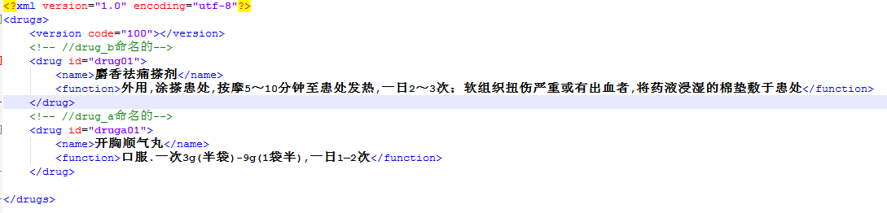
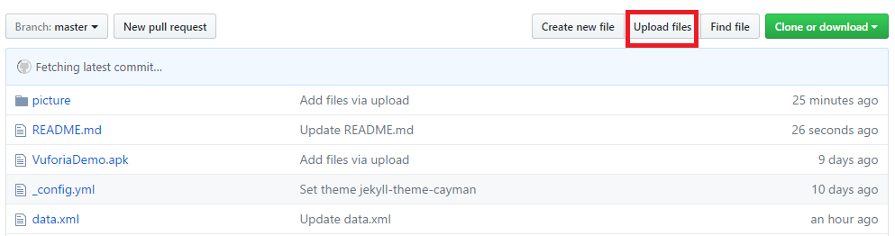

# Project.github.io (药品识别数据更新) 
## 1、版本数据更新
### (1).修改药品数据文件data.xml
+ 编辑药品数据文件data.xml

   
    
   a.整个文件以  \<drugs>\</drugs> 开始和结束
   
   b.文件版本以 \<version>\</version>编辑,每次更新版本要讲版本号+1，并和配置文件update.php中的versionCode一致
   
   c.文件中每编辑一个药品以 \<drug>\</drug>开始和结束,id是药品图片的名字,和Vuforia云端上的名字一致，\<name>\</name>表示药品的名字,\<function>\</function>表示药品的用法用量

+ 上传药品数据文件
   
   
   
   a.选择图中所示的upload files -> choose your files,选择上传的文件,待文件上传完成后，点击页面下的Commit Changes,文件上传完成.
   
### (2).修改更新配置文件update.php

## 2、Apk版本更新
### (1).上传新版Apk版本

### (2).修改更新配置文件update.php

##
