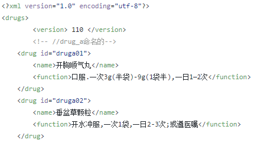

# Project.github.io (药品识别数据更新) 
## 1、版本数据更新
### (1).修改药品数据文件data.xml
+ 编辑药品数据文件data.xml

   
    
   
+ 上传药品数据文件

### (2).修改更新配置文件update.php

## 2、Apk版本更新
### (1).上传新版Apk版本

### (2).修改更新配置文件update.php

##
